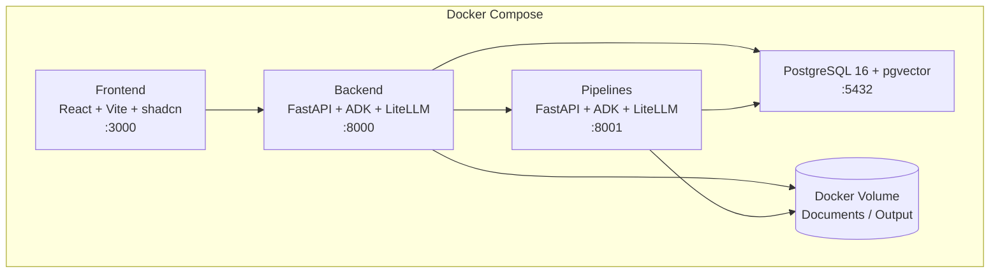

# Norma

Norma is a cloud-agnostic, LLM-agnostic platform that uses [LiteLLM](https://docs.litellm.ai/) to abstract away model providers. Any LLM backend — Vertex AI, OpenAI, Azure, or others — can be swapped without code changes.

## Architecture



| Service      | Stack                          | Port |
| ------------ | ------------------------------ | ---- |
| **Frontend** | React + Vite + Tailwind/shadcn | 3000 |
| **Backend**  | FastAPI + ADK + LiteLLM        | 8000 |
| **Pipelines**| FastAPI + ADK + LiteLLM        | 8001 |
| **Database** | PostgreSQL 16 + pgvector       | 5432 |

## Quick Start

```bash
# 1. Clone the repo
git clone https://github.com/airbus/norma.git
cd norma

# 2. Copy environment config
cp .env.example .env

# 3. Start the full stack
docker compose up
```

The frontend is available at `http://localhost:3000`, the backend API at `http://localhost:8000`, and the pipelines service at `http://localhost:8001`.

## Development

See [CONTRIBUTING.md](CONTRIBUTING.md) for detailed development setup instructions.

### Frontend

```bash
cd frontend
npm install
npm run dev
```

### Backend / Pipelines

```bash
cd backend   # or cd pipelines
uv sync
uv run python main.py
```

### Database Migrations

```bash
cd backend
uv run alembic upgrade head        # apply migrations
uv run alembic revision --autogenerate -m "description"  # create migration
```

## Project Structure

```
norma/
├── frontend/          # React + Vite + Tailwind CSS
│   └── src/
├── backend/           # FastAPI + ADK + LiteLLM
│   ├── app/
│   │   ├── api/       # API routes
│   │   ├── agents/    # ADK agents
│   │   ├── core/      # Config, database
│   │   ├── models/    # SQLAlchemy models
│   │   ├── schemas/   # Pydantic schemas
│   │   └── services/  # Business logic
│   └── alembic/       # Database migrations
├── pipelines/         # Data processing service
│   ├── app/
│   │   ├── api/       # API routes
│   │   ├── core/      # Config, database
│   │   ├── models/    # SQLAlchemy models
│   │   ├── services/  # Business logic
│   │   └── tasks/     # Pipeline tasks
│   └── ...
└── docker-compose.yml
```

## License

See [LICENSE](LICENSE) for details.
