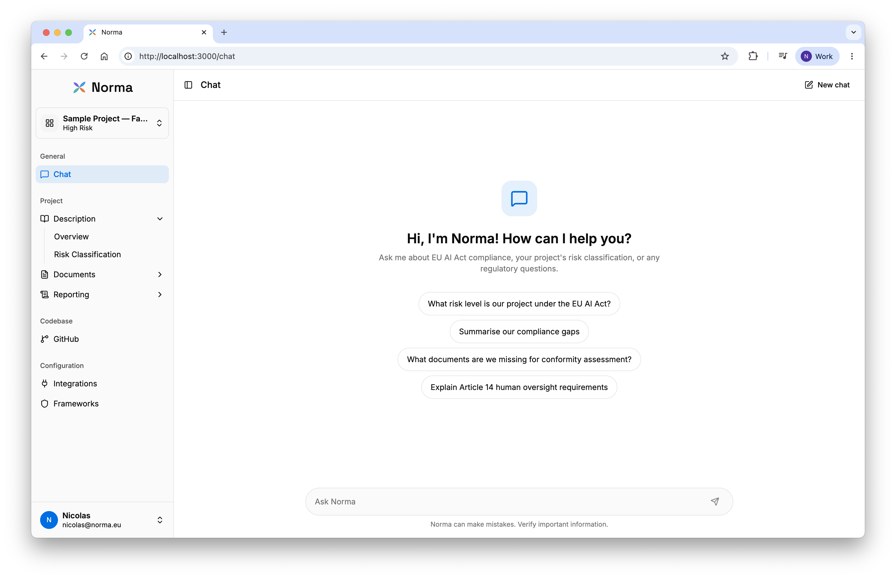
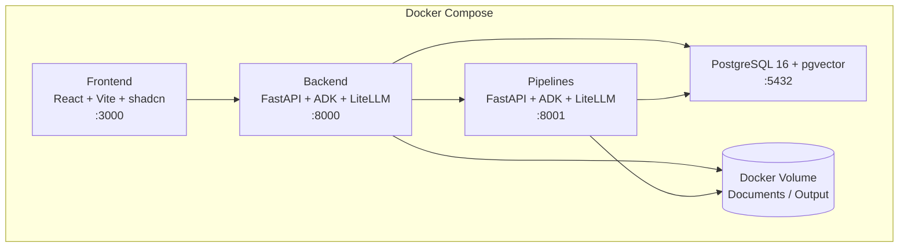

<p align="center">
  
</p>

<p align="center">
  <em>AI compliance, simplified</em>
</p>

<p align="center">
  <a href="https://github.com/airbus/norma/actions/workflows/ci.yml"></a>
  <a href="LICENSE"></a>
  
  
  
  
</p>

---

<!-- TODO: Add a screenshot of the Norma UI here -->
<!-- <p align="center"></p> -->

## What is Norma?

Norma is a platform that helps teams manage AI compliance across multiple regulatory frameworks, including the **EU AI Act**, **Environmental Impact**, and **UNDP Human Rights** assessments.

It combines structured project management with an AI-powered assistant that understands your project context, uploaded documents, codebase, and compliance obligations. Norma guides you through risk classification, evidence gathering, and reporting, all in one place.

Norma is **cloud-agnostic** and **LLM-agnostic**. It uses [LiteLLM](https://docs.litellm.ai/) to abstract model providers, so any backend (Vertex AI, OpenAI, Azure, or others) can be swapped without code changes.

## Features

**Risk Classification.** Interactive questionnaire following the EU AI Act decision tree to determine your AI system's risk level.

**Multi-Framework Reporting.** Structured checklists for EU AI Act, Environmental Impact, and UNDP Human Rights frameworks with evidence tracking and validation.

**Document Management.** Upload compliance documents as PDFs. Norma extracts and summarises the content so the AI assistant can reference it in context.

**Norma AI Assistant.** A context-aware chat assistant that understands your project details, uploaded documents, codebase, and reporting progress to provide tailored compliance guidance.

**Codebase Analysis.** Connect a GitHub repository to generate architecture diagrams and technical summaries that feed into compliance assessments.

**Multi-Language Support.** Full interface localisation in English, Spanish, French, and German, with AI responses adapted to the user's preferred language.

**LLM-Agnostic.** Swap between any LLM provider (Vertex AI, OpenAI, Azure, local models) by changing a single environment variable.

## Architecture



| Service | Stack | Port |
| --- | --- | --- |
| **Frontend** | React 19, Vite, Tailwind CSS, shadcn/ui | 3000 |
| **Backend** | FastAPI, Google ADK, LiteLLM, SQLAlchemy | 8000 |
| **Pipelines** | FastAPI, Google ADK, LiteLLM, PyMuPDF | 8001 |
| **Database** | PostgreSQL 16 + pgvector | 5432 |

## Quick Start

```bash
git clone https://github.com/airbus/norma.git
cd norma
cp .env.example .env
# Edit .env to configure your LLM provider (see .env.example for options)
docker compose up
```

The frontend is available at [localhost:3000](http://localhost:3000), the backend API at [localhost:8000](http://localhost:8000), and the pipelines service at [localhost:8001](http://localhost:8001).

## Development

See [CONTRIBUTING.md](CONTRIBUTING.md) for the full development setup, code style, and PR process.

```bash
# Frontend
cd frontend && npm install && npm run dev

# Backend or Pipelines
cd backend && uv sync && uv run python main.py

# Database migrations
cd backend && uv run alembic upgrade head
```

## Documentation

| Document | Description |
| --- | --- |
| [Architecture](docs/architecture.md) | System design, data models, and integration patterns |
| [API Reference](docs/api-reference.md) | REST endpoint documentation |
| [Chat Agent](docs/chat-agent.md) | Norma AI assistant architecture and prompt assembly |
| [Document Processing](docs/document-processing.md) | PDF upload, text extraction, and summarisation pipeline |
| [Risk Evaluation](docs/risk-evaluation.md) | EU AI Act risk classification decision tree |
| [Deployment](docs/deployment.md) | Docker Compose configuration and production setup |

## Contributing

Contributions are welcome. Please read the [contributing guidelines](CONTRIBUTING.md) and [code of conduct](CODE_OF_CONDUCT.md) before opening a pull request.

## Licence

This project is licensed under the Apache License 2.0. See the [LICENSE](LICENSE) file for details.
