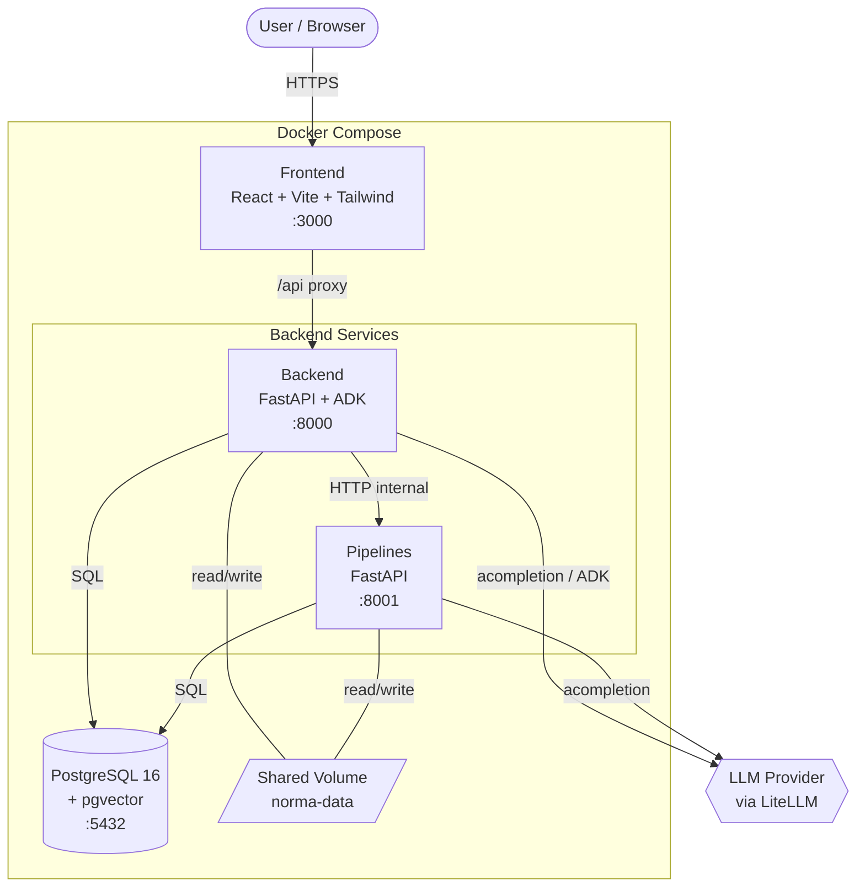
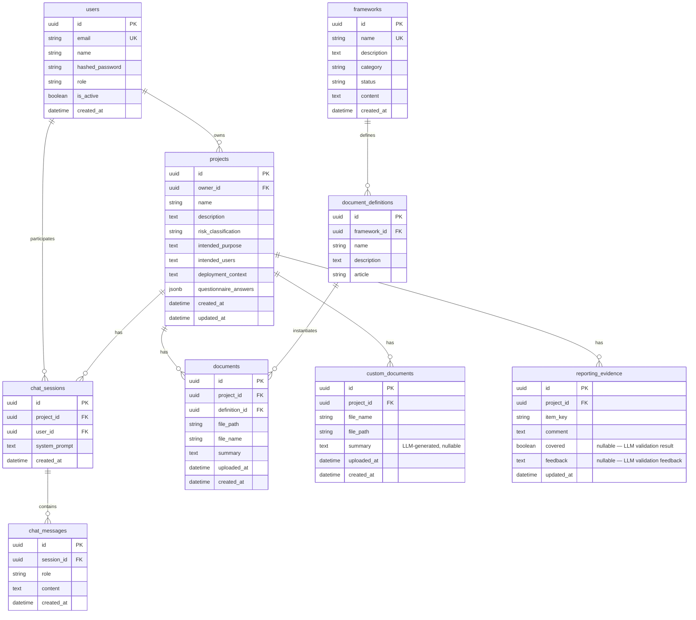
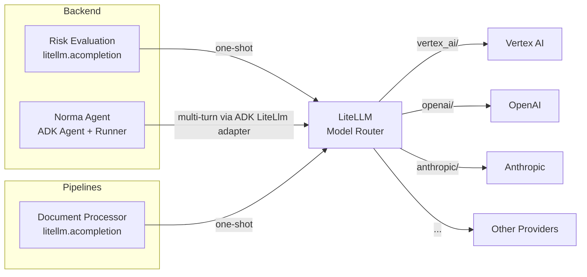
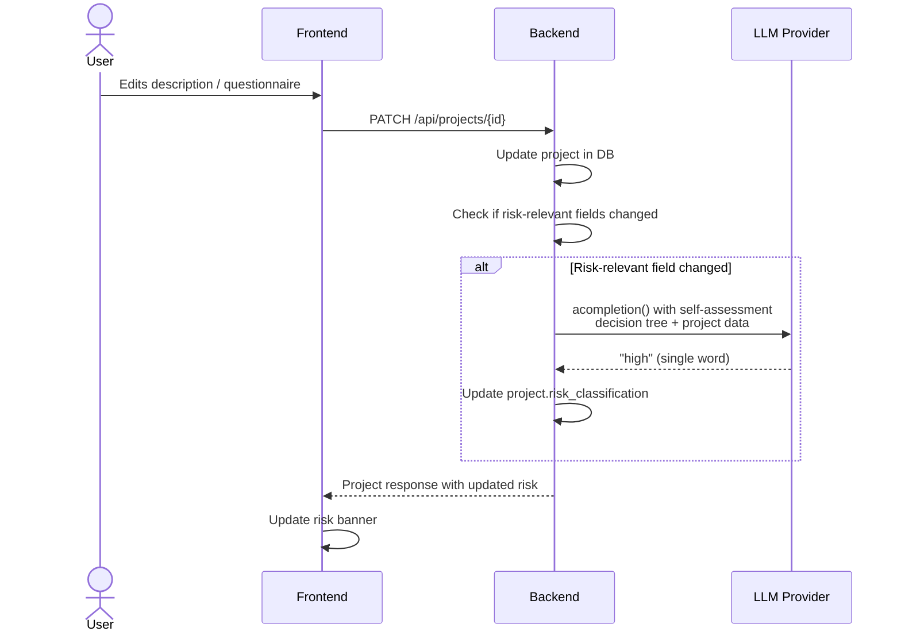
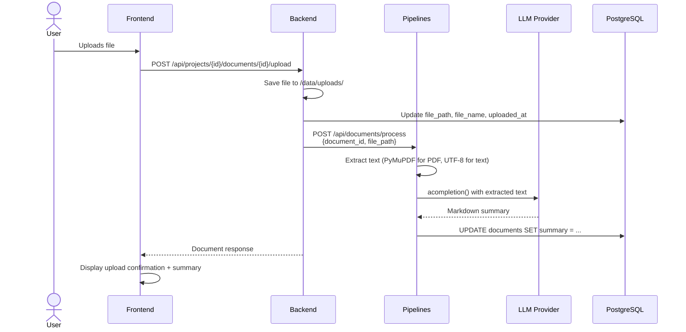
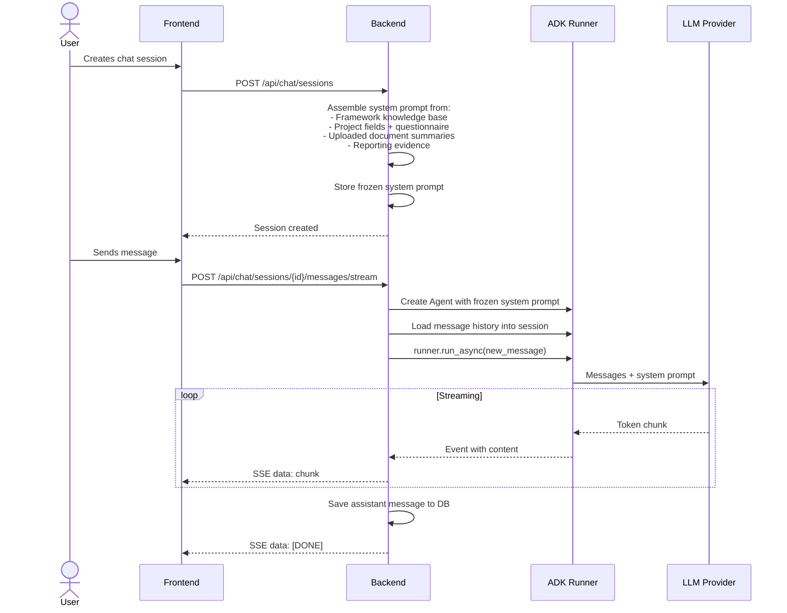

# Architecture

Norma is a cloud-agnostic, LLM-agnostic compliance management platform that helps organisations assess, track, and demonstrate conformity with the EU AI Act and other regulatory frameworks. It combines structured project management workflows with LLM-powered features — dynamic risk classification, document summarisation, and a context-aware compliance assistant.

The platform is built as a three-service architecture orchestrated by Docker Compose, sharing a PostgreSQL database and a file storage volume.

## System Overview



## Services

### Frontend

**Stack:** React 18, Vite, Tailwind CSS, shadcn/ui, Lucide icons, React Router

The single-page application provides the full user workflow:

- **Project management** — create and configure AI system compliance projects
- **Self-assessment questionnaire** — 17-question EU AI Act decision tree (6 sections covering AI system identification, prohibited practices, regulated products, standalone systems, GPAI, and transparency)
- **Risk banner** — real-time display of the LLM-evaluated risk classification with re-evaluate controls
- **Document checklist** — per-framework required documents with file upload and LLM-generated summaries, plus free-form custom PDF uploads
- **Reporting checklist** — compliance evidence tracking with free-text comments per item and AI-powered suggestion generation
- **Chat interface** — streaming conversation with the Norma AI assistant, with full project context
- **Settings** — user and admin management (invite links, user listing)

In production, the frontend is served via Nginx which proxies `/api` requests to the backend service.

### Backend

**Stack:** FastAPI, SQLAlchemy 2.0, Alembic, Google ADK (>=2.0), LiteLLM, Pydantic v2

The central API server handling all business logic:

| Module | Responsibility |
|--------|---------------|
| **Authentication** (`app/api/routes/auth.py`) | JWT-based auth with bcrypt password hashing. Users register via single-use invite tokens created by admins. Tokens expire after 7 days. |
| **Projects** (`app/api/routes/projects.py`) | Full CRUD for compliance projects. PATCH requests that modify risk-relevant fields (description, intended purpose, intended users, deployment context, questionnaire answers) automatically trigger an LLM-based risk evaluation. |
| **Risk Evaluation** (`app/services/risk_evaluation.py`) | One-shot LLM call using `litellm.acompletion()` that classifies a project as `unacceptable`, `high`, `limited`, or `minimal` based on the EU AI Act self-assessment decision tree. |
| **Chat / Norma Agent** (`app/agents/norma.py`, `app/api/routes/chat.py`) | Multi-turn AI assistant built on Google ADK. System prompt assembled from framework knowledge, project context, uploaded document summaries, and reporting evidence. Supports both synchronous and SSE streaming responses. |
| **Documents** (`app/api/routes/documents.py`) | Manages per-project document instances derived from framework-defined templates, plus free-form custom PDF uploads. Handles file uploads and delegates processing to the Pipelines service. |
| **Reporting** (`app/api/routes/reporting.py`) | Bulk upsert of compliance checklist evidence entries keyed by item identifier. Each entry stores the user's comment alongside an LLM-generated validation result (`covered` flag and `feedback` text). Includes a suggestion endpoint that generates context-aware comments and a validation endpoint that evaluates whether an answer satisfies the compliance question. |
| **Frameworks** (`app/api/routes/frameworks.py`) | Read-only endpoints for regulatory frameworks and their metadata. |
| **Seeding** (`app/services/seed.py`) | On startup, seeds the EU AI Act framework with its required document definitions and loads knowledge base content from markdown files. Also creates a sample project for newly registered users. |
| **Migrations** (`alembic/`) | Alembic manages schema migrations, run automatically on backend startup. |

### Pipelines

**Stack:** FastAPI, LiteLLM, PyMuPDF

A lightweight, independently scalable service dedicated to heavy processing tasks. Currently handles document processing:

1. **Text extraction** — reads uploaded files (PDF via PyMuPDF, or plain text for Markdown/TXT/CSV/JSON/XML/HTML)
2. **LLM summarisation** — sends extracted text to `litellm.acompletion()` with a structured prompt requesting comprehensive markdown summaries
3. **Database update** — writes the generated summary back to the `documents.summary` or `custom_documents.summary` column (determined by the `table_name` parameter)

The Pipelines service shares the `norma-data` volume with the Backend for file access and connects directly to PostgreSQL for writing summaries.

### Database

**Stack:** PostgreSQL 16 with pgvector extension



Key design decisions:

- **`frameworks.content`** stores the full knowledge base (concatenated markdown files) rather than referencing external files at runtime. This ensures the chat agent's context is self-contained and the knowledge base is versioned with the database.
- **`chat_sessions.system_prompt`** is frozen at session creation time. This guarantees conversation consistency — the agent's context doesn't shift mid-conversation if the user updates their project.
- **`questionnaire_answers`** uses JSONB to accommodate the variable structure of the self-assessment questionnaire (mix of single-select and multi-select answers).
- **`reporting_evidence`** uses a composite unique constraint on `(project_id, item_key)` for idempotent upserts.

## LLM Integration

Norma uses **LiteLLM** as the model abstraction layer, configured via the `NORMA_LITELLM_MODEL` environment variable. This supports any LiteLLM-compatible provider (Vertex AI, OpenAI, Anthropic, Azure, etc.) without code changes.



Two distinct LLM usage patterns:

| Pattern | Used By | How | Purpose |
|---------|---------|-----|---------|
| **One-shot classification** | Risk evaluation, Document processing | `litellm.acompletion()` directly | Single-turn, structured output. Risk eval returns exactly one word. Document processing returns a markdown summary. |
| **Multi-turn agent** | Norma chat | Google ADK `Agent` + `Runner` + `InMemorySessionService`, with `LiteLlm` model adapter | Conversational AI assistant with full project context in the system prompt. Supports streaming via SSE. |

## Data Flows

### Risk Evaluation

Triggered automatically when a user updates any risk-relevant project field, or manually via the "Re-evaluate" button.



### Document Upload and Summarisation



### Chat with Norma



## Knowledge Base

Regulatory knowledge is stored as markdown files organised by framework and loaded into the database at startup:

```
backend/app/data/knowledge/
  eu_ai_act/
    00_getting_started.md      -- Introduction and overview (sorted first)
    eu_ai_act_summary.md       -- Full regulation summary
    high_risk_guidelines.md    -- High-risk system compliance guide
    sandbox_guidelines.md      -- AI regulatory sandbox guide
```

The seed service scans each framework's subdirectory by name slug (e.g., `eu_ai_act` for "EU AI Act"), concatenates all `.md` files in sorted order, and stores the result in `frameworks.content`. On subsequent startups, if file content has changed, the database is updated automatically.

This content is included in the Norma chat agent's system prompt, giving it deep regulatory knowledge to draw from when answering user questions.
