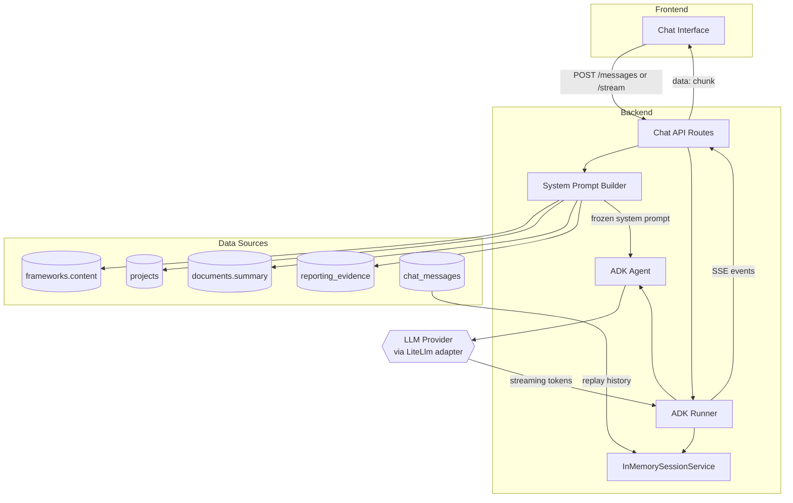
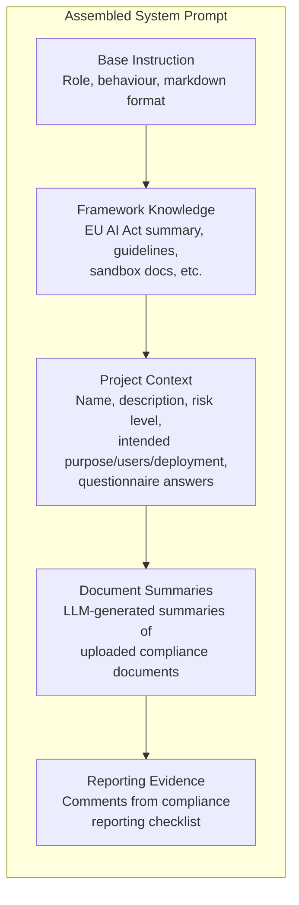

# Chat Agent (Norma)

Norma is a multi-turn AI assistant that helps users understand and comply with the EU AI Act. It is built on Google ADK (Agent Development Kit) and uses LiteLLM for model-agnostic LLM access.

## Architecture



### Components

| Component | Class | Purpose |
|-----------|-------|---------|
| **Agent** | `google.adk.agents.Agent` | Configured with a system instruction, the `LiteLlm` model adapter, and `temperature=0.2` |
| **Runner** | `google.adk.runners.Runner` | Executes the agent for a given session and user message, yielding streaming events |
| **Session Service** | `google.adk.sessions.InMemorySessionService` | Manages ADK session state. A new in-memory session is created per API request, with prior messages loaded from the database |
| **LiteLlm** | `google.adk.models.lite_llm.LiteLlm` | ADK model adapter that wraps LiteLLM for provider-agnostic access. This is different from calling `litellm.acompletion()` directly — it integrates with ADK's agent lifecycle |

## System Prompt Assembly

The system prompt is assembled when a chat session is created and frozen on the `chat_sessions.system_prompt` column. This ensures conversation consistency — the agent's context doesn't shift mid-conversation if the user updates their project.



### What each section provides

| Section | Source | Gives the agent... |
|---------|--------|--------------------|
| **Base instruction** | Hardcoded in `norma.py` | Its identity, role boundaries, and response format |
| **Framework knowledge** | `frameworks.content` column | Deep regulatory knowledge (EU AI Act articles, risk classification logic, compliance procedures) |
| **Project context** | `projects` table | Awareness of the specific AI system being assessed |
| **Document summaries** | `documents.summary` column | Understanding of compliance documents the user has already prepared |
| **Reporting evidence** | `reporting_evidence` table | Knowledge of which checklist items the user has addressed |

## Knowledge Base

Framework knowledge is stored in the `frameworks.content` database column, loaded at startup from markdown files in `backend/app/data/knowledge/`. Files are organised by framework:

```
backend/app/data/knowledge/
  eu_ai_act/
    00_getting_started.md       # Introduction and overview (sorted first)
    eu_ai_act_summary.md        # Full regulation summary
    high_risk_guidelines.md     # High-risk system compliance guide
    sandbox_guidelines.md       # AI regulatory sandbox guide
```

The seed service (`backend/app/services/seed.py`) reads all `.md` files from each framework's subdirectory (sorted alphabetically), concatenates them with `---` separators, and stores the result in `frameworks.content`. On subsequent startups, if file content has changed, the database is updated automatically.

## Chat Session Lifecycle

```mermaid
stateDiagram-v2
    [*] --> Created: POST /api/chat/sessions
    note right of Created: System prompt frozen<br/>from current project state

    Created --> Active: First message sent

    Active --> Active: User sends message
    note right of Active: Each message:<br/>1. Save user msg to DB<br/>2. Create ADK session<br/>3. Replay history<br/>4. Run agent<br/>5. Save assistant msg

    Active --> [*]: Session abandoned<br/>(no explicit close)
```

A chat session is scoped to a single project and user. Key behaviours:

- **Frozen context** — The system prompt captures the project state at creation time. If the user updates their project, existing sessions retain their original context. Create a new session to pick up the latest state.
- **History replay** — On each message, all prior messages in the session are loaded from the database and replayed into the ADK in-memory session. This gives the LLM full conversation context.
- **No session persistence in ADK** — ADK sessions are ephemeral (in-memory). The database is the source of truth for conversation history.

## Endpoints

### Non-streaming

`POST /api/chat/sessions/{session_id}/messages`

Sends a user message and returns the complete assistant response. Waits for the full response before returning.

### Streaming

`POST /api/chat/sessions/{session_id}/messages/stream`

Sends a user message and returns the response as Server-Sent Events (SSE). Each event contains a text chunk. The stream ends with `data: [DONE]`. The complete response is saved to the database after streaming completes.

## Configuration

| Setting | Description |
|---------|-------------|
| `NORMA_LITELLM_MODEL` | LiteLLM model identifier (e.g., `vertex_ai/gemini-2.5-flash`) |
| Temperature | Set to `0.2` in `create_norma_agent()` for focused, factual responses |

## Files

| File | Purpose |
|------|---------|
| `backend/app/agents/norma.py` | Agent definition, system prompt builder |
| `backend/app/api/routes/chat.py` | Chat API endpoints (create session, send message, stream) |
| `backend/app/services/seed.py` | Knowledge base loading and framework seeding |
| `backend/app/data/knowledge/` | Markdown knowledge base files |
