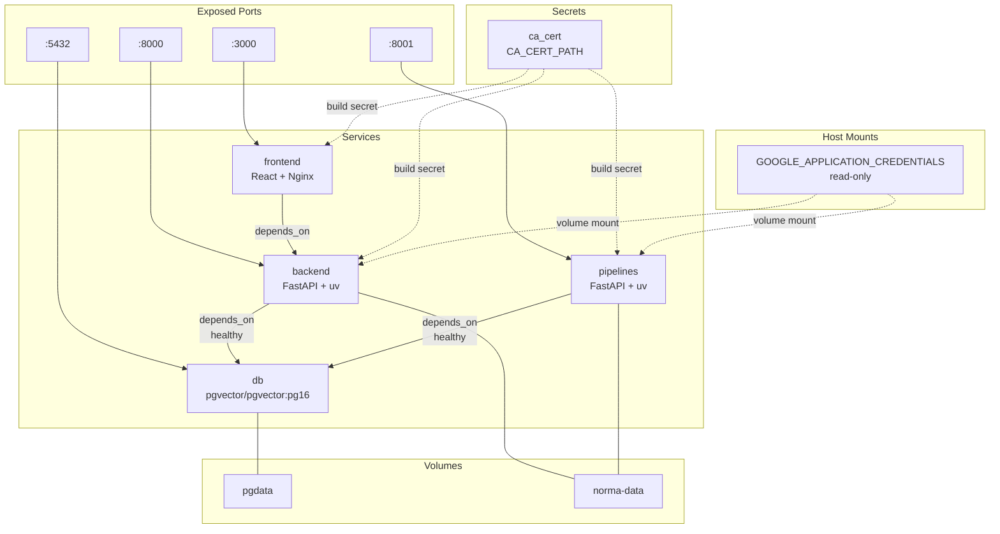
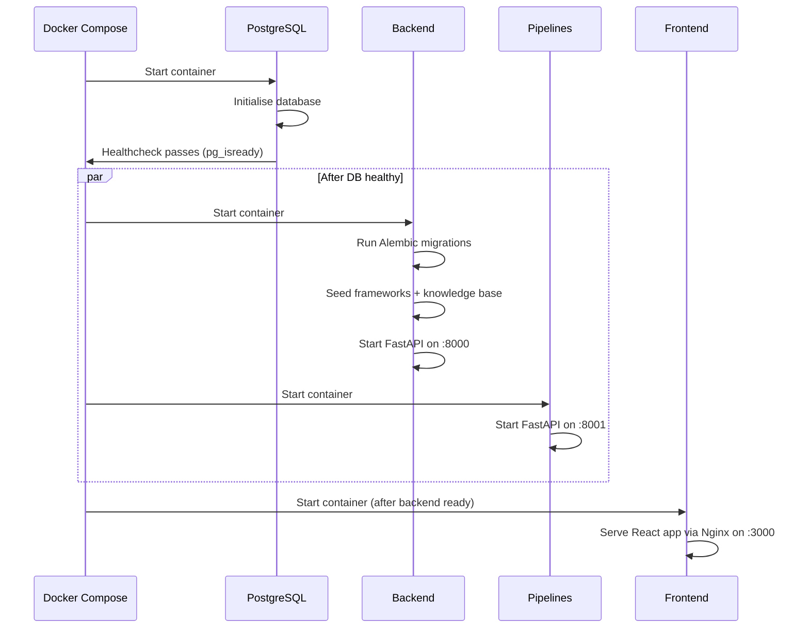

# Deployment

Norma runs as a Docker Compose stack with four services: frontend, backend, pipelines, and PostgreSQL.

## Quick Start

```bash
# 1. Copy and configure environment
cp .env.example .env
# Edit .env with your LLM provider credentials

# 2. Start the stack
docker compose up --build

# 3. Access the application
# Frontend: http://localhost:3000
# Backend API: http://localhost:8000
# Pipelines API: http://localhost:8001
```

## Docker Compose Topology



## Environment Variables

Configure these in `.env` (gitignored):

### Required

| Variable | Description | Example |
|----------|-------------|---------|
| `NORMA_DATABASE_URL` | PostgreSQL connection string | `postgresql+psycopg://norma:norma@db:5432/norma` |
| `NORMA_JWT_SECRET_KEY` | JWT signing key (generate with `openssl rand -base64 32`) | — |

### LLM Provider

| Variable | Description | Example |
|----------|-------------|---------|
| `NORMA_LITELLM_MODEL` | LiteLLM model identifier | `vertex_ai/gemini-2.5-flash` |
| `VERTEXAI_PROJECT` | Google Cloud project (for Vertex AI) | `my-gcp-project` |
| `VERTEXAI_LOCATION` | Google Cloud region (for Vertex AI) | `europe-west1` |
| `GOOGLE_APPLICATION_CREDENTIALS` | Path to service account JSON on the host | `/home/user/.config/gcloud/adc.json` |

The `GOOGLE_APPLICATION_CREDENTIALS` file is mounted read-only into the backend and pipelines containers at `/root/.config/gcloud/application_default_credentials.json`. It is never copied into images — the Docker Compose file uses `${GOOGLE_APPLICATION_CREDENTIALS:-/dev/null}` to gracefully handle missing credentials.

For non-Vertex providers, set the appropriate LiteLLM environment variables (e.g., `OPENAI_API_KEY` for OpenAI, `ANTHROPIC_API_KEY` for Anthropic).

### Optional

| Variable | Description | Default |
|----------|-------------|---------|
| `NORMA_PIPELINES_URL` | Internal URL for the pipelines service | `http://pipelines:8001` |
| `NORMA_CORS_ORIGINS` | Allowed CORS origins (JSON array) | `["http://localhost:5173","http://localhost:3000"]` |
| `NORMA_DEBUG` | Enable debug logging | `false` |
| `CA_CERT_PATH` | Path to corporate CA certificate (for Docker builds behind proxy) | `/dev/null` |
| `UV_INDEX_URL` | Python package index URL | `https://pypi.org/simple/` |
| `NPM_REGISTRY` | npm registry URL | `https://registry.npmjs.org/` |

## Startup Sequence



## Docker Compose Services

| Service | Port | Image | Notes |
|---------|------|-------|-------|
| `frontend` | 3000 | Custom (React + Nginx) | Proxies `/api` to backend |
| `backend` | 8000 | Custom (FastAPI + uv) | Runs Alembic migrations and seeds DB on startup |
| `pipelines` | 8001 | Custom (FastAPI + uv) | Document and codebase processing worker |
| `db` | 5432 | `pgvector/pgvector:pg16` | PostgreSQL with pgvector extension |

### Volumes

| Volume | Mounted at | Purpose |
|--------|-----------|---------|
| `pgdata` | `/var/lib/postgresql/data` | PostgreSQL data persistence |
| `norma-data` | `/data` | Shared file storage (uploaded documents), mounted on backend and pipelines |

### Secrets

Docker build secrets are used for corporate proxy environments:

- `ca_cert` — Corporate CA certificate, sourced from `CA_CERT_PATH` env var. Defaults to `/dev/null` (no cert). Used during `docker build` only, not baked into images.

## Database

PostgreSQL 16 with pgvector. The database is initialised automatically by Docker Compose with default credentials (`norma`/`norma`/`norma`).

### Migrations

Alembic migrations run automatically on backend startup. To run manually:

```bash
cd backend

# Apply all pending migrations
uv run alembic upgrade head

# Create a new migration
uv run alembic revision --autogenerate -m "description"
```

### Seeding

On startup, the backend seeds two compliance frameworks (EU AI Act and UNDP Human Rights Assessment) and their required documents from `backend/app/services/seed.py`. Additional frameworks (e.g., Environmental Impact Framework) can be added dynamically from the Frameworks page. Knowledge base content is loaded from markdown files in `backend/app/data/knowledge/`. If framework content has changed since the last startup, the database is updated automatically.

On first user registration, sample projects are created automatically with pre-filled reporting evidence to demonstrate the platform's capabilities.

## Local Development (Without Docker)

```bash
# Frontend
cd frontend && npm install && npm run dev
# Runs on http://localhost:5173

# Backend
cd backend && uv sync && uv run python main.py
# Runs on http://localhost:8000

# Pipelines
cd pipelines && uv sync && uv run python main.py
# Runs on http://localhost:8001
```

Requires a running PostgreSQL instance. Update `NORMA_DATABASE_URL` in `.env` to point to your local database.

## Linting

```bash
# Frontend
cd frontend && npm run lint && npm run format:check

# Backend
cd backend && uv run ruff check . && uv run ruff format --check .

# Pipelines
cd pipelines && uv run ruff check . && uv run ruff format --check .
```

Pre-commit hooks are configured with gitleaks (secret detection) and ruff (linting + formatting). Install with `pre-commit install`.
