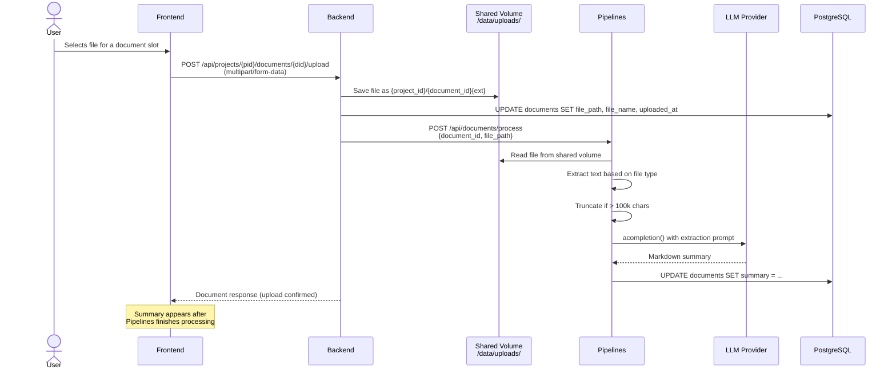
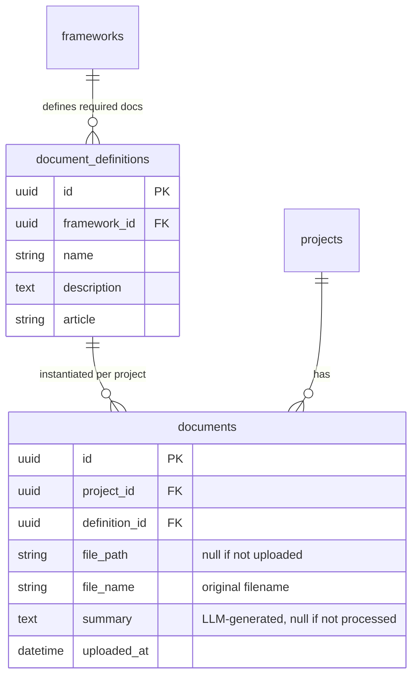

# Document Processing

The document processing pipeline handles file uploads, text extraction, and LLM-powered summarisation for compliance documents.

## Overview

Each compliance framework defines a set of required documents (e.g., "Technical Documentation" per Annex IV of the EU AI Act). When a user opens a project's documents page, document placeholders are automatically created for every framework definition. Users can then upload files against each placeholder.

## Upload and Processing Flow



## Document Data Model



### How documents are created

Document instances are created lazily — when a user first visits the documents page for a project, the backend checks which `document_definitions` don't yet have a corresponding `documents` row for that project and creates them. This means every project automatically gets placeholders for all framework-required documents.

## Text Extraction

The Pipelines service (`pipelines/app/tasks/document_processor.py`) handles text extraction based on file type:

| File Type | Method |
|-----------|--------|
| PDF (`.pdf`) | PyMuPDF (`fitz`) — extracts text page by page |
| Text-based (`.md`, `.txt`, `.csv`, `.json`, `.xml`, `.html`) | Direct UTF-8 read |
| Other | Attempted as UTF-8 text with error replacement |

Documents exceeding 100,000 characters are truncated with a `[... document truncated for processing ...]` marker before being sent to the LLM.

## Summary Generation

The extracted text is sent to LiteLLM (`litellm.acompletion()`) with `max_tokens=4096` and a structured prompt requesting:

- A brief overview paragraph
- Key sections with their main points
- Specific requirements, obligations, or action items
- Any deadlines, thresholds, or quantitative criteria mentioned

The summary is stored in the `documents.summary` column and serves two purposes:

1. **Documents page** — displayed directly to the user as a readable summary of the uploaded file
2. **Chat agent context** — included in the Norma agent's system prompt so the assistant can reference uploaded document content when answering questions

## File Storage

```
/data/uploads/                    # Shared Docker volume (norma-data)
  {project_id}/
    {document_id}.pdf             # Stored with original extension
    {document_id}.md
    ...
```

Both the Backend and Pipelines services mount the `norma-data` volume at `/data`. The Backend writes files during upload; the Pipelines service reads them during processing.

## Files

| File | Purpose |
|------|---------|
| `backend/app/api/routes/documents.py` | Upload endpoint, document listing, lazy document creation |
| `backend/app/models/document.py` | `Document` and `DocumentDefinition` SQLAlchemy models |
| `backend/app/services/seed.py` | Seeds `document_definitions` from framework config |
| `pipelines/app/tasks/document_processor.py` | Text extraction and LLM summary generation |
| `pipelines/app/api/routes/documents.py` | Processing endpoint called by the backend |
