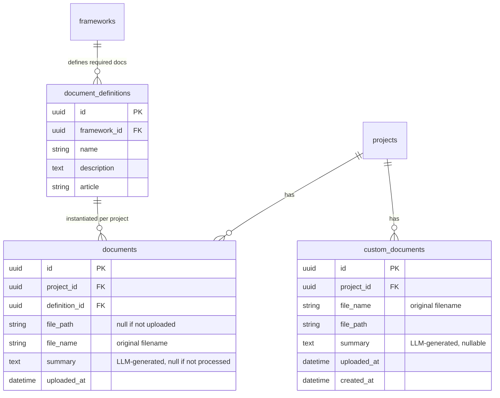
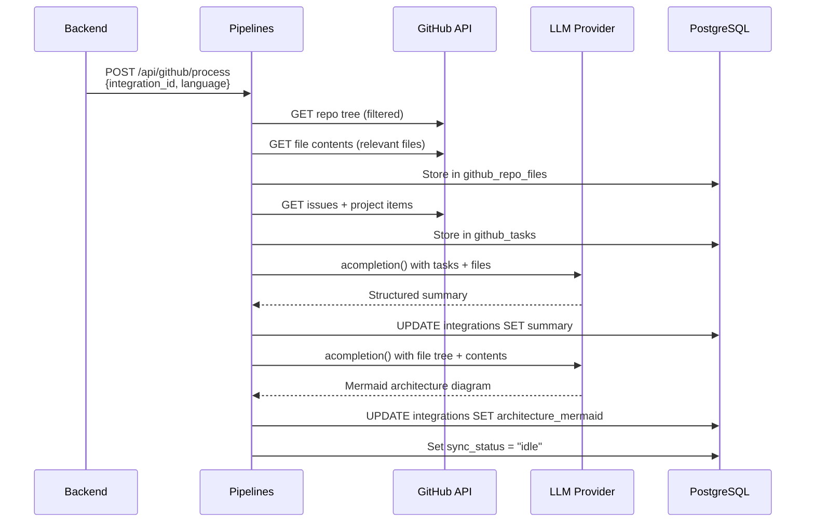

# Document and Codebase Processing

The Pipelines service handles two types of processing: document uploads (text extraction and summarisation) and GitHub repository analysis (codebase summary and architecture diagram generation).

## Document Processing

The document processing pipeline handles file uploads, text extraction, and LLM-powered summarisation for compliance documents.

## Overview

Each compliance framework defines a set of required documents (e.g., "Technical Documentation" per Annex IV of the EU AI Act). When a user opens a project's documents page, document placeholders are automatically created for every framework definition. Users can then upload files against each placeholder.

Additionally, users can upload free-form custom PDF documents that are not tied to any framework definition. These are stored in a separate `custom_documents` table and processed through the same pipeline.

## Upload and Processing Flow


## Document Data Model



### How documents are created

Document instances are created lazily — when a user first visits the documents page for a project, the backend checks which `document_definitions` don't yet have a corresponding `documents` row for that project and creates them. This means every project automatically gets placeholders for all framework-required documents.

## Text Extraction

The Pipelines service (`pipelines/app/tasks/document_processor.py`) handles text extraction based on file type:

| File Type | Method |
|-----------|--------|
| PDF (`.pdf`) | PyMuPDF (`fitz`) — extracts text page by page |
| Text-based (`.md`, `.txt`, `.csv`, `.json`, `.xml`, `.html`) | Direct UTF-8 read |
| Other | Attempted as UTF-8 text with error replacement |

Documents exceeding 100,000 characters are truncated with a `[... document truncated for processing ...]` marker before being sent to the LLM.

## Summary Generation

The extracted text is sent to LiteLLM (`litellm.acompletion()`) with `max_tokens=4096` and a structured prompt requesting:

- A brief overview paragraph
- Key sections with their main points
- Specific requirements, obligations, or action items
- Any deadlines, thresholds, or quantitative criteria mentioned

The summary is stored in the `documents.summary` or `custom_documents.summary` column and serves three purposes:

1. **Documents page** — displayed directly to the user as a readable summary of the uploaded file
2. **Chat agent context** — included in the Norma agent's system prompt so the assistant can reference uploaded document content when answering questions
3. **Reporting suggestions** — included in the context for AI-generated compliance checklist suggestions

## File Storage

```
/data/uploads/                    # Shared Docker volume (norma-data)
  {project_id}/
    {document_id}.pdf             # Framework documents, stored with original extension
    {document_id}.md
    ...
    custom/
      {document_id}.pdf           # Custom documents (PDF only)
```

Both the Backend and Pipelines services mount the `norma-data` volume at `/data`. The Backend writes files during upload; the Pipelines service reads them during processing.

## GitHub Processing

When a user triggers a repository sync, the Backend calls the Pipelines service to process the connected GitHub repository.

### Sync Flow



### Summary Generation

The GitHub processor (`pipelines/app/tasks/github_processor.py`) generates two outputs:

**Technical summary** with four sections:
1. Overview of the repository
2. Tech stack and dependencies
3. Current tasks and priorities
4. Key observations

**Architecture diagram** as a Mermaid graph showing the system's main components and their relationships, accompanied by a bullet-point description.

Both outputs respect the user's language preference. Prompts are truncated at 200,000 characters to stay within LLM context limits.

### File Filtering

The processor fetches the repository tree from GitHub and filters out files that are unlikely to be relevant to compliance analysis (e.g., lock files, build artefacts, test fixtures). Only files matching common source code and configuration patterns are fetched and stored.

## Files

| File | Purpose |
|------|---------|
| `backend/app/api/routes/documents.py` | Upload endpoint, document listing, lazy document creation, custom document CRUD |
| `backend/app/api/routes/integrations.py` | Integration CRUD, sync trigger, task listing |
| `backend/app/models/document.py` | `Document` and `DocumentDefinition` SQLAlchemy models |
| `backend/app/models/custom_document.py` | `CustomDocument` SQLAlchemy model for free-form uploads |
| `backend/app/models/integration.py` | `Integration`, `GitHubTask`, `GitHubRepoFile` models |
| `backend/app/services/seed.py` | Seeds `document_definitions` from framework config |
| `pipelines/app/tasks/document_processor.py` | Text extraction and LLM summary generation |
| `pipelines/app/tasks/github_processor.py` | GitHub repository analysis and diagram generation |
| `pipelines/app/api/routes/documents.py` | Document processing endpoint called by the backend |
| `pipelines/app/api/routes/github.py` | GitHub processing endpoint called by the backend |
