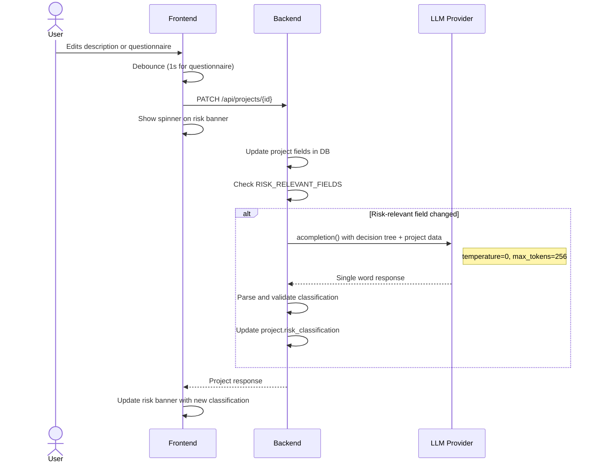
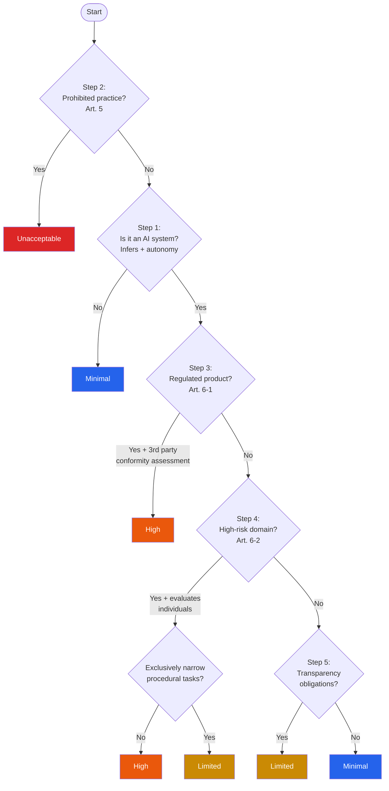

# Dynamic Risk Evaluation

The risk evaluation system automatically classifies an AI project's risk level under the EU AI Act whenever the user updates project details or questionnaire answers.

## How It Works

## Risk Levels

| Level | Meaning | EU AI Act Reference |
|-------|---------|-------------------|
| **Unacceptable** | Prohibited AI practice (e.g., social scoring, subliminal manipulation, real-time biometric ID in public spaces) | Article 5 |
| **High** | System requires conformity assessment, CE marking, and full documentation | Articles 6-7 |
| **Limited** | System has transparency obligations (e.g., chatbots must disclose they are AI) | Article 50 |
| **Minimal** | No specific regulatory requirements beyond voluntary codes of practice | — |

## Self-Assessment Decision Tree

The LLM follows a 5-step decision tree embedded in the system prompt. The decision tree is evaluated holistically — the LLM considers all inputs together and returns the highest applicable risk level.

**Important:** Step 2 (prohibited practices) is always checked first, regardless of whether the system qualifies as an AI system under Step 1. If any prohibited practice is selected, the result is always `unacceptable`.

## Questionnaire Mapping

The frontend self-assessment questionnaire maps to the decision tree:

| Field | Question | Decision Tree Step |
|-------|----------|-------------------|
| `q1` | Infers from inputs to generate outputs | Step 1 |
| `q2` | Operates with some level of autonomy | Step 1 |
| `q3` | Prohibited practices (multi-select) | Step 2 |
| `q4` | Covered by EU product safety legislation | Step 3 |
| `q5` | Requires third-party conformity assessment | Step 3 |
| `q6` | Primary domain of use (biometrics, critical infra, education, etc.) | Step 4 |
| `q7` | Evaluates individual natural persons | Step 4 |
| `q8` | Performs profiling | Step 4 |
| `q9` | Exclusively narrow/procedural tasks | Step 4 |
| `q15` | Interacts directly with people | Step 5 |
| `q16` | Generates synthetic content | Step 5 |
| `q17` | Can create deepfakes | Step 5 |

## Implementation Details

### Risk Evaluation Service

**File:** `backend/app/services/risk_evaluation.py`

- Uses `litellm.acompletion()` directly (not ADK) for a single-turn, structured response
- `max_tokens=256`, `temperature=0` for deterministic output
- Includes Gemini-specific `safety_settings` to prevent content filtering on sensitive topics (surveillance, biometrics) — see issue #15 for making this model-agnostic
- Response parsing: exact match against `{unacceptable, high, limited, minimal}` first, then substring search as fallback
- Returns `None` on failure — classification is left unchanged (graceful degradation)

### Trigger Logic

**File:** `backend/app/api/routes/projects.py`

- `RISK_RELEVANT_FIELDS = {"description", "intended_purpose", "intended_users", "deployment_context", "questionnaire_answers"}`
- Evaluation runs synchronously within the PATCH handler so the response includes the updated risk
- Also triggers on project creation if any context fields are provided
- Manual re-evaluation available via `POST /api/projects/{id}/evaluate-risk`

### Frontend UX

**File:** `frontend/src/pages/description.tsx`, `frontend/src/components/risk-banner.tsx`

- Spinning `Loader2` icon on the risk banner while evaluation is in-flight
- Questionnaire changes are debounced (1 second) to avoid redundant LLM calls during rapid selections
- "Re-evaluate" button with `RefreshCw` icon for manual re-trigger
